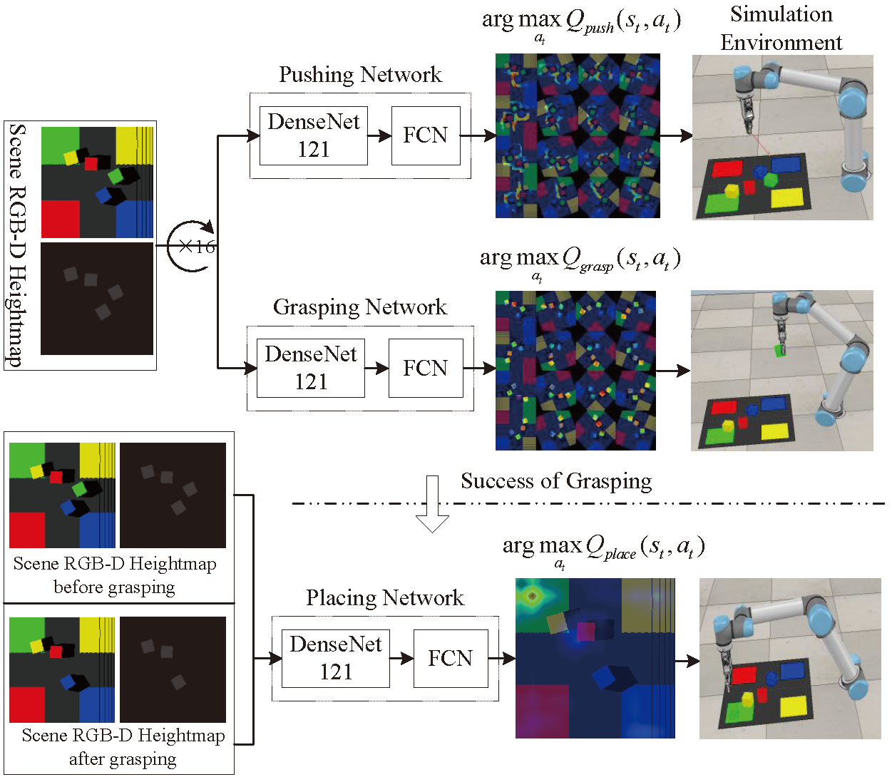
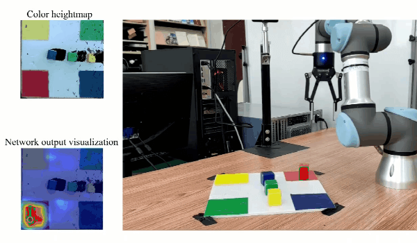
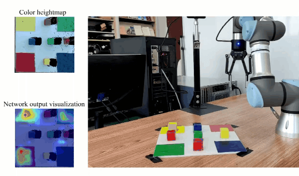

# Learn Multi-Step Object Sorting Tasks through Deep Reinforcement Learning

This repository will provide PyTorch code for training and testing object sorting policies with deep reinforcement learning in both simulation and real-world settings on a UR5/UR3 robot arm. This is the reference implementation for the paper which has been published on <i>Robotica</i>.

### Learn Multi-Step Object Sorting Tasks through Deep Reinforcement Learning

Robotic systems are traditionally controlled to repetitively perform specific actions for manufacturing tasks. These control methods are usually domain-dependent and model-dependent and cost lots of human efforts. They cannot meet the emerging requirements of generality and flexibility in many areas such as intelligent manufacturing and customized production. This paper develops a general model-free approach to enable robots to perform multi-step object sorting tasks through deep reinforcement learning. Taking projected heightmap images from different time steps as input without extra high-level image analysis and understanding, critic models are designed for producing a pixel-wise Q value map for each type of action. It is a new trial to apply pixel-wise Q value based critic networks on solving multi-step sorting tasks that involve many types of actions and complex action constraints. The experimental validations on simulated and realistic object sorting tasks demonstrate the effectiveness of the proposed approach.

<!--  -->
<div align="center"></div>


#### Citing

If you find this code useful in your work, please consider citing:
```
@article{bao2022sort,
  title={Learn Multi-Step Object Sorting Tasks through Deep Reinforcement Learning},
  author={Bao, Jiatong and Zhang, Guoqing and Peng, Yi and Shao, Zhiyu and Song, Aiguo},
  DOI={10.1017/S0263574722000650},
  journal={Robotica},
  publisher={Cambridge University Press},
  year={2022},
  pages={1–17}
}
```

#### Demo Videos

These two videos show how the simulated robot performs on sorting 6 cuboid blocks with random colors after 5000-step and 30000-step trial-and-errors, respectively.
<table>
<tr>
<td></td>
<td></td>
</tr>
<tr>
<td align="center">after 5,000 steps</td>
<td align="center">after 30,000 steps</td>
</tr>
</table>

In order to show the potential capability of our model, the task of sorting 10 blocks with random colors and shapes is performed.
<table>
<tr>
<td></td>
<td></td>
</tr>
<tr>
<td align="center">after 30,000 steps</td>
<td align="center">after 50,000 steps</td>
</tr>
</table>

Demo videos of a real robot in action.
<table>
<tr>
<td></td>
<td></td>
</tr>
<tr>
<td align="center">sort four blocks in real setups</td>
<td align="center">sort six blocks in real setups</td>
</tr>
</table>

#### Contact
If you have any questions or find any bugs, please let me know: [Jiatong Bao] jtbao[at]yzu[dot]edu[dot]cn

## Installation
We use PyTorch (1.8) to implement and train the models on a PC with Intel Core CPU i9-10900KF, NVIDIA GTX 3090 GPU (with CUDA 11.1.1 and cuDNN 8.1.0) and 32G memory running Ubuntu 16.04.

1. Install [Anaconda](https://www.anaconda.com/) and create virtual environment
```shell
conda create -n sort python=3.8.10 -y
```
2. Install [PyTorch](https://pytorch.org/)
```shell
conda activate sort
conda install pytorch=1.8 torchvision cudatoolkit=11.1 -c pytorch -c conda-forge
```
3. Install python libraries
```shell
pip3 install numpy scipy opencv-python matplotlib
```
4. Install [V-REP](http://www.coppeliarobotics.com/) (now known as [CoppeliaSim](http://www.coppeliarobotics.com/)) simulation environment

## How to run
#### Prepare simulation environment
Run V-REP (navigate to your V-REP/CoppeliaSim directory and run `./vrep.sh` or `./coppeliaSim.sh`). From the main menu, select `File` > `Open scene...`, and open the file `DRLSorting/simulation/simulation.ttt` from this repository.

#### Training
```shell
export CUDA_VISIBLE_DEVICES="0" && python3 main.py --is_sim --obj_mesh_dir objects/blocks --num_obj 10 --push_rewards --experience_replay --random_actions --use_commonsense --explore_rate_decay --future_reward_discount 0.65 --max_iter 40000 --save_visualization
```

#### Continue training
```shell
export CUDA_VISIBLE_DEVICES="0" && python3 main.py --is_sim --obj_mesh_dir objects/blocks --num_obj 10 --push_rewards --experience_replay --random_actions --use_commonsense --explore_rate_decay --future_reward_discount 0.65 --max_iter 40000 --save_visualization --load_snapshot --snapshot_file './logs/2021-11-24.10:29:18/models/snapshot-backup.reinforcement.pth' --continue_logging --logging_directory './logs/2021-11-24.10:29:18'
```

#### How to plot
```shell
python metric_plot_train.py --log_dir 'plot'
```

#### How to evaluate
```shell
python metric_eval_test.py --log_dir './logs/2021-12-24.14:59:43/transitions' --object_num 4
```

#### Real scene testing
```shell
export CUDA_VISIBLE_DEVICES="0" && python3 main.py --is_testing --num_obj 6 --load_snapshot --snapshot_file './logs/Model3/snapshot-backup.reinforcement.pth' --heightmap_resolution 0.00125 --max_test_trials 20
```

#### Pretrained Models
Model1 (trained on tasks of sorting 4 blocks with fixed colors) 
[Download](https://drive.google.com/file/d/1_tFZJUNs0p9UkGV4AiDwF7955unbNRTS/view?usp=sharing)<br>
Model2 (trained on tasks of sorting 4 blocks with random colors) [Download](
https://drive.google.com/file/d/12Czid2KE0FcPVsUPCM_L4qba5_3qdnku/view?usp=sharing)<br>
Model3 (trained on tasks of sorting 6 blocks with random colors) [Download](
https://drive.google.com/file/d/1cdqIqTWBgmWhSkWcDLdIbAWwhDlH8Rfv/view?usp=sharing)<br>
Model4 (trained on tasks of sorting 10 blocks with random colors and shapes) [Download](https://drive.google.com/file/d/1pqfEmlQrTnzZvlUdiGR5E8Io2Aq7jA0R/view?usp=sharing)

## Acknowledgement
Our code is based on [VPG](https://github.com/andyzeng/visual-pushing-grasping) and [Good Robot!](https://github.com/jhu-lcsr/good_robot).